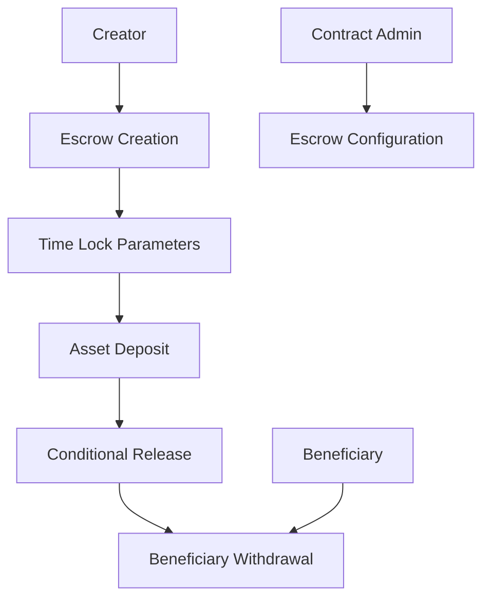

# Timelock Interpreter

A flexible smart contract for creating time-locked escrow and asset management on the Stacks blockchain.

## Overview

The Timelock Interpreter is a robust smart contract that provides secure, programmable time-based asset locking and release mechanisms. It enables complex escrow scenarios, scheduled fund distributions, and conditional asset transfers with precise time-based controls.

### Key Features
- Create time-locked escrow contracts
- Define complex release conditions
- Support for multiple asset types
- Transparent and auditable asset management
- Customizable time-based unlock strategies
- Secure, on-chain governance of locked assets

## Architecture

The contract provides a flexible framework for time-based asset management, supporting various escrow and distribution scenarios.



## Contract Documentation

### Core Contract: timelock-escrow.clar

#### Purpose
Manages time-locked asset escrow, providing secure, programmable mechanisms for asset release based on predefined time and condition constraints.

#### Key Components
1. **Escrow Definitions**: Stores escrow metadata and release parameters
2. **Time Lock Mechanisms**: Defines time-based unlock conditions
3. **Asset Management**: Handles deposits, locks, and releases
4. **Governance**: Administrative controls for escrow operations

## Getting Started

### Prerequisites
- Clarinet installed
- Stacks wallet for deployment/interaction

### Usage Examples

1. Create a Time-Locked Escrow:
```clarity
(contract-call? .timelock-escrow create-escrow 
    tx-sender ;; beneficiary
    block-height ;; start-block
    u10000 ;; lock-duration
    u5000000 ;; total-amount
)
```

2. Deposit Assets:
```clarity
(contract-call? .timelock-escrow deposit-assets 
    u1 ;; escrow-id
    u5000000 ;; amount
)
```

3. Release Locked Assets:
```clarity
(contract-call? .timelock-escrow release-assets u1)
```

## Function Reference

### Escrow Management
- `create-escrow`: Initialize a new time-locked escrow
- `deposit-assets`: Add assets to an escrow
- `release-assets`: Trigger asset release
- `cancel-escrow`: Cancel and refund an escrow

### Query Functions
- `get-escrow-details`: Retrieve escrow information
- `check-release-eligibility`: Verify release conditions
- `get-locked-balance`: Check current locked balance

### Administrative
- `update-escrow-terms`: Modify escrow parameters
- `set-contract-admin`: Transfer administrative rights

## Development

### Local Testing
```bash
# Run local tests
clarinet test

# Check contract
clarinet check
```

### Deployment
```bash
# Deploy to testnet
clarinet deploy --testnet

# Deploy to mainnet
clarinet deploy --mainnet
```

## Security Considerations

### Limitations
- Maximum escrow duration based on block height
- Minimum deposit amounts
- Single beneficiary per escrow
- Immutable release conditions after creation

### Best Practices
1. Verify escrow parameters thoroughly
2. Understand block-height based time locking
3. Check beneficiary and deposit constraints
4. Use administrative functions cautiously
5. Validate asset availability before operations

### Security Guarantees
- Cryptographically secure asset locking
- Transparent, on-chain verification
- Immutable release conditions
- Admin-limited modification capabilities